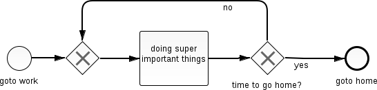

% Camunda-BPM @devCamp 2014
% Simon Weis
% <dc:date>

# Camunda-BPM

* Camunda
  	* Company from Berlin
  	* http://camunda.com

* BPM(N)
	* Business Process Model (and Notation)
	* http://www.bpmn.org
	* from OMG

--------------

# BPMN 2.0

# Camunda-Engine

- Process-Engine
- Execute BPMN 2.0 models
- Open Source
- Supports Java EE
- Runs on Glasfish, Jboss, Tomcat, ...
- Fork of Activiti-Engine

--------------------------

# Demonstration
- find the code on __https://github.com/detached/camunda-demo__

--------------------------

# Experience

## Benefits of using BPMN 2.0 + Process-Engine

- Management <-> Developer
- Documentation
- Reusability
- Monitoring
- Operating

--------------------------

## Drawbacks

- Dependency to product
- Additional component
- Engine documentation not that good
- Performance

--------------------------

# Thank you
